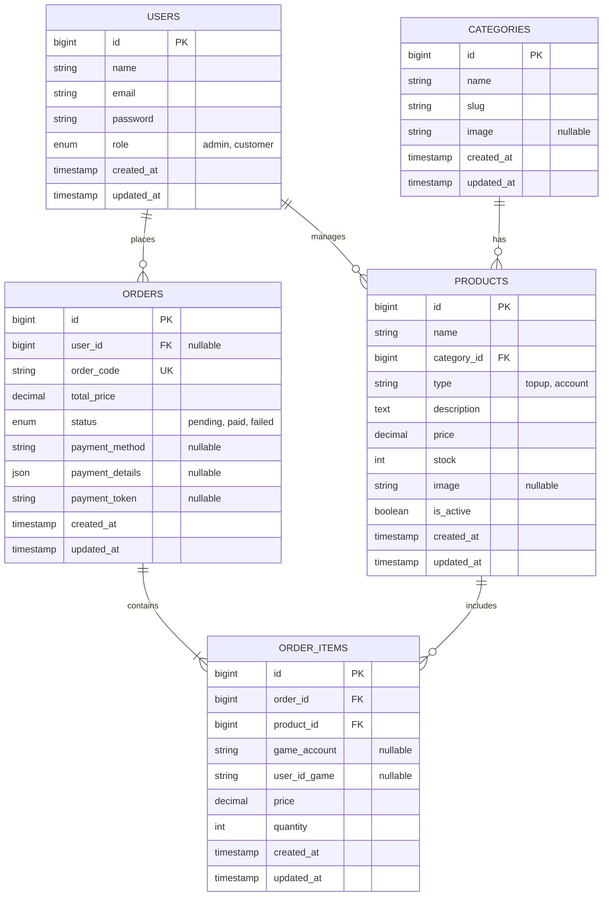

# Web Top-Up & Storefront Game

Aplikasi web untuk top-up game dan jual beli akun. Dibuat menggunakan Laravel 11, aplikasi ini mendukung guest checkout , pelacakan transaksi otomatis, dan integrasi pembayaran Midtrans.

---

## 🛠️ Teknologi yang Digunakan

*   **Backend Core:** Laravel 11.x (PHP 8.3+)
*   **Autentikasi:** Laravel Breeze (Livewire Volt)
*   **Frontend:** Tailwind CSS, Alpine.js, dan FontAwesome 6
*   **Database:** MySQL / MariaDB
*   **Payment Gateway:** Midtrans Snap API & Webhooks
*   **Containerization:** Docker & Docker Compose

---

## 📊 Skema Database

### Diagram ERD



### Detail Tabel

#### 1. Tabel `users`
Menyimpan data pengguna dan role akses.
*   `id` (BIGINT, PK, Auto Increment)
*   `name` (VARCHAR) - Nama lengkap.
*   `email` (VARCHAR, Unique) - Email login.
*   `password` (VARCHAR) - Hash password.
*   `role` (ENUM: `'admin'`, `'customer'`) - Role akses.
*   `created_at` / `updated_at` (TIMESTAMP)

#### 2. Tabel `categories`
Menyimpan kategori game (seperti Mobile Legends, Free Fire, dll).
*   `id` (BIGINT, PK, Auto Increment)
*   `name` (VARCHAR) - Nama kategori game.
*   `slug` (VARCHAR, Unique) - Slug URL.
*   `image` (VARCHAR, Nullable) - File gambar kategori.
*   `created_at` / `updated_at` (TIMESTAMP)

#### 3. Tabel `products`
Menyimpan daftar paket top-up atau akun game yang dijual.
*   `id` (BIGINT, PK, Auto Increment)
*   `category_id` (BIGINT, FK) - Relasi ke `categories.id`.
*   `name` (VARCHAR) - Nama produk (misal: "50 Diamonds").
*   `type` (VARCHAR) - Tipe produk: `'topup'` atau `'account'`.
*   `description` (TEXT, Nullable) - Deskripsi produk.
*   `price` (DECIMAL 15,2) - Harga produk.
*   `stock` (INT) - Jumlah stok.
*   `image` (VARCHAR, Nullable) - Gambar produk.
*   `is_active` (BOOLEAN) - Status aktif/nonaktif produk.
*   `created_at` / `updated_at` (TIMESTAMP)

#### 4. Tabel `orders`
Menyimpan data transaksi pembelian.
*   `id` (BIGINT, PK, Auto Increment)
*   `user_id` (BIGINT, FK, Nullable) - Relasi ke `users.id`. Null jika checkout sebagai guest.
*   `order_code` (VARCHAR, Unique) - Kode invoice unik.
*   `total_price` (DECIMAL 15,2) - Total nominal transaksi.
*   `status` (ENUM: `'pending'`, `'paid'`, `'failed'`) - Status transaksi.
*   `payment_method` (VARCHAR, Nullable) - Metode pembayaran (misal: gopay, qris).
*   `payment_details` (JSON, Nullable) - Payload respons pembayaran lengkap dari Midtrans.
*   `payment_token` (VARCHAR, Nullable) - Token Snap Midtrans untuk pembayaran ulang.
*   `created_at` / `updated_at` (TIMESTAMP)

#### 5. Tabel `order_items`
Rincian produk di dalam order.
*   `id` (BIGINT, PK, Auto Increment)
*   `order_id` (BIGINT, FK) - Relasi ke `orders.id` (cascade).
*   `product_id` (BIGINT, FK) - Relasi ke `products.id` (cascade).
*   `game_account` (VARCHAR, Nullable) - ID game pembeli (untuk produk top-up).
*   `user_id_game` (VARCHAR, Nullable) - Zone/Server ID game pembeli (untuk produk top-up).
*   `price` (DECIMAL 15,2) - Harga produk saat dibeli.
*   `quantity` (INT) - Jumlah pembelian.
*   `created_at` / `updated_at` (TIMESTAMP)

---

## 🔒 Sistem Autentikasi & Keamanan

### 1. Autentikasi Customer
*   **Sistem:** Menggunakan Laravel Breeze dengan Livewire Volt.
*   **Alur:** Pendaftaran dan masuk akun dilakukan secara asinkron. Setelah login berhasil, pengguna diarahkan ke halaman utama (`'/'`) agar langsung bisa belanja tanpa masuk ke dashboard kosong.
*   **Profil:** Pengguna dapat memperbarui nama, password, dan email melalui rute `/profile`.

### 2. Pengamanan Rute Admin (404 Shield)
Untuk menyembunyikan panel admin dari publik, rute admin diamankan dengan sistem pengalihan 404:
*   Jika guest (belum login) atau customer biasa mencoba mengakses `/admin` atau `/admin/*`, middleware akan langsung menghentikan request dan menampilkan halaman **`404 Not Found`**.
*   Login admin hanya bisa diakses melalui rute khusus `/admin/login`.

### 3. Logout Bebas Error 419 (Session Expired)
Tombol logout standar rawan memicu error "419 Page Expired" jika halaman dibiarkan terbuka terlalu lama hingga sesi habis.
*   Rute logout diubah menjadi tipe hybrid `match(['get', 'post'], '/logout')` tanpa proteksi auth. 
*   Ketika diklik, sistem langsung menghapus sesi dan cookie, lalu mengalihkan pengguna ke beranda dengan bersih.

---

## 🌐 Daftar Rute (Route Registry)

### Rute Publik
| Method | URI | Action | Keterangan |
| :--- | :--- | :--- | :--- |
| **GET** | `/` | `FrontController@index` | Halaman katalog game utama. |
| **GET** | `/category/{slug}` | `FrontController@category` | List produk berdasarkan kategori. |
| **GET** | `/product/{id}` | `FrontController@show` | Detail produk game. |
| **GET** | `/track-order` | `FrontController@trackIndex` | Halaman tracking (riwayat otomatis untuk customer / cari nomor HP untuk guest). |
| **POST** | `/track-order/search` | `FrontController@trackSearch` | Pencarian order guest berdasarkan nomor HP. |

### Rute Pembayaran & Webhook
| Method | URI | Action | Keterangan |
| :--- | :--- | :--- | :--- |
| **POST** | `/checkout/{product}` | `CheckoutController@store` | Validasi input, input order, dan generate token Snap Midtrans. |
| **POST** | `/payment/notification` | `CheckoutController@notification` | **Webhook (Bypass CSRF)** untuk update status pesanan otomatis via Midtrans. |
| **GET** | `/payment/finish` | `CheckoutController@finish` | Redirect sukses dari Midtrans ke halaman receipt. |
| **GET** | `/payment/unfinish` | `CheckoutController@unfinish` | Redirect pending dari Midtrans ke halaman receipt. |
| **GET** | `/payment/error` | `CheckoutController@error` | Redirect gagal dari Midtrans ke halaman receipt. |
| **GET** | `/order/receipt/{order_code}` | `CheckoutController@receipt` | Nota pembelian digital dengan layout cetak. |

### Rute Admin (Diproteksi role:admin)
| Method | URI | Action | Keterangan |
| :--- | :--- | :--- | :--- |
| **GET** | `/admin/login` | *Volt Component* | Login khusus akun admin. |
| **GET** | `/admin/dashboard` | `DashboardController@index` | Ringkasan statistik penjualan. |
| **RESOURCE** | `/admin/categories`| `CategoryController` | CRUD data kategori game. |
| **RESOURCE** | `/admin/products` | `ProductController` | CRUD paket produk game. |
| **RESOURCE** | `/admin/orders` | `OrderController` | Detail transaksi masuk. |

---

## ⚡ Validasi & Penanganan Error

### 1. Validasi Input Pembelian
Pada saat checkout (`CheckoutController@store`), input diverifikasi secara ketat:
*   `email` -> Wajib berformat email valid dan maksimal 255 karakter.
*   `phone` -> Wajib diisi (untuk nomor WhatsApp).
*   `game_id` / `zone_id` -> Wajib diisi jika produk bertipe `'topup'`.

### 2. Validasi Tanda Tangan Webhook
Untuk mencegah manipulasi status pembayaran, rute webhook memvalidasi tanda tangan SHA512 yang dikirim oleh Midtrans:
```php
$localSignature = hash('sha512', $orderId . $statusCode . $grossAmount . $serverKey);
if ($signatureKey !== $localSignature) {
    return response()->json(['message' => 'Invalid signature key'], 403);
}
```
Jika tanda tangan tidak valid, request langsung ditolak dengan status `403 Forbidden`.

---

## 💻 Panduan Instalasi (Docker)

Aplikasi ini menggunakan Docker Compose untuk mempermudah konfigurasi server lokal.

### Persyaratan
*   Docker dan Docker Compose sudah terpasang di sistem Anda.

### Langkah-Langkah Setup

#### 1. Jalankan Container Docker
Jalankan perintah berikut di direktori root project (tempat file `docker-compose.yml` berada):
```bash
docker-compose up -d --build
```
Perintah ini akan secara otomatis:
*   Membangun dan menjalankan container untuk **PHP-FPM**, **Nginx** (port 8010), dan **MySQL** (port 3310).
*   Membuat file `.env` di dalam folder `marketplace_app` (jika belum ada) dan mengisi kredensial database secara otomatis dari variabel Docker.
*   Mengunduh dependensi PHP via Composer.
*   Menjalankan migrasi database otomatis.

#### 2. Install & Build Aset Frontend (NPM)
Gunakan perintah `docker-compose exec` untuk masuk ke container `app` dan mengompilasi aset frontend:
```bash
# Install dependensi frontend
docker-compose exec app npm install

# Build aset frontend untuk production
docker-compose exec app npm run build
```

#### 3. Konfigurasi Pembayaran Midtrans
Buka file `.env` di dalam folder `marketplace_app` dan masukkan Server Key & Client Key dari akun Midtrans Sandbox Anda:
```env
MIDTRANS_MERCHANT_ID=merchant_id_anda
MIDTRANS_CLIENT_KEY=client_key_anda
MIDTRANS_SERVER_KEY=server_key_anda
MIDTRANS_IS_PRODUCTION=false
```

#### 4. Buat Akun Admin Pertama & Seed Kategori
Untuk mengisi data awal game (Mobile Legends, Free Fire, dll) dan membuat satu akun admin default, jalankan perintah seeder di dalam container:
```bash
docker-compose exec app php artisan db:seed --class=StoreSeeder
```
*Setelah selesai, akun administrator default yang dapat Anda gunakan:*
*   **Email Admin:** `admin@gmail.com`
*   **Password:** `password`

#### 5. Akses Aplikasi
*   **Storefront (Halaman Publik):** Buka `http://localhost:8010` di browser Anda.
*   **Panel Admin:** Buka `http://localhost:8010/admin/login` untuk mengelola produk dan pesanan.

---

## 🌿 Format Commit Git

Riwayat pengerjaan repositori dikelompokkan dengan prefix commit berikut:
*   `feat:` — Penambahan fitur baru (misal: `feat: tambah webhook midtrans`).
*   `fix:` — Perbaikan bug (misal: `fix: atasi error 419 pada logout`).
*   `refactor:` — Struktur ulang kode tanpa mengubah fungsi (misal: `refactor: rapikan controller order`).
*   `style:` — Perbaikan styling visual CSS/HTML.
